

  

<h1 align="center">
  
</h1>

  <strong>BSIT Student at Quezon City University | Project Manager | Fullstack Student Dev</strong>

---

### About Me

* 🔭 **Current Project:** Building **PARMS** (Patient Appointment and Record Management System) and **Rixsume**.
* 🛡️ **Cybersecurity:** Active member of the **Lil:Pwny** CTF team. I focus on Cryptography and Web Exploitation.
* 🌱 **Learning:** Advanced Server-side Architecture and Penetration Testing.
* 💬 **Ask Me About:** MERN Stack, Backend Logic, or CTF Writeups.
* ⚡ **Fun Fact:** I spend more time in the terminal than in a browser.

---

### Tech Stack

#### Development

  

#### Security & Tools

  

---

## Certifications & Badges

### APISEC University Badges

  <a href="https://www.credly.com/badges/9f6c35d0-d371-427c-b297-2f92df7e3504/public_url" target="_blank">
    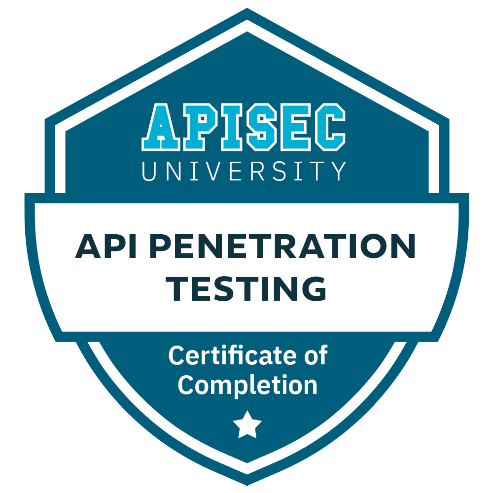
  </a>
  <a href="https://www.credly.com/badges/ae650af3-e593-4703-bcad-781fad3af07d/public_url" target="_blank">
    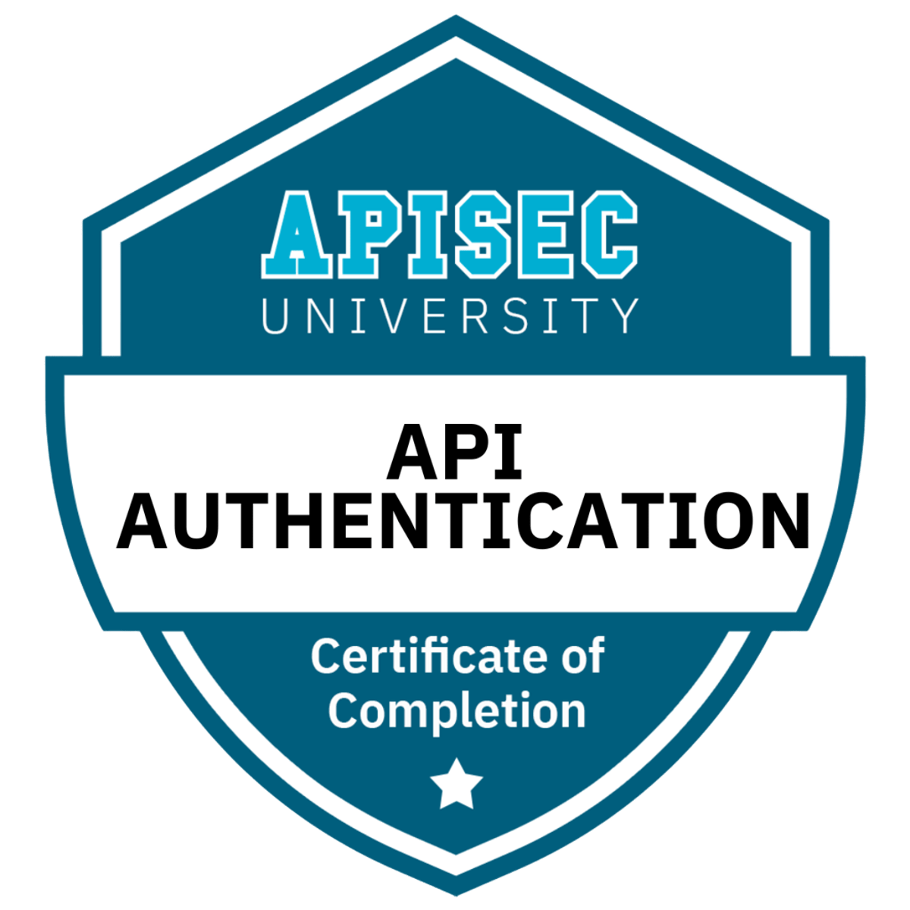
  </a>
  
  <a href="https://www.credly.com/badges/ab2fc6ea-de0e-485a-a2c2-863b61edcedc/public_url target="_blank">
    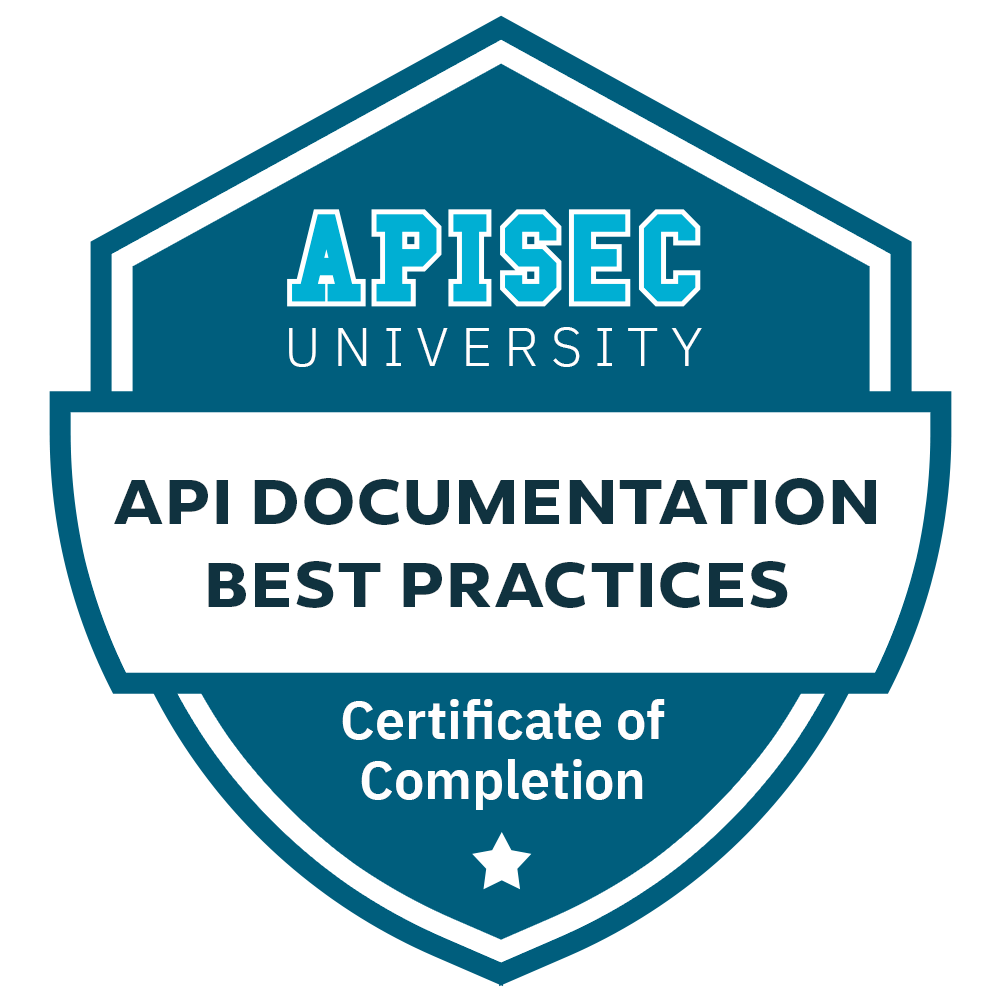
  </a>
  <a href="https://www.credly.com/badges/d389568e-b7e8-4c1b-a693-4c90117eb4af/public_url" target="_blank">
    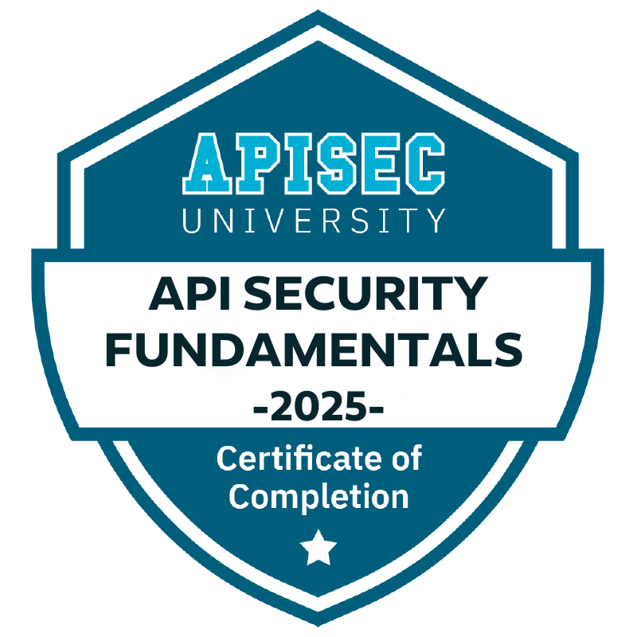
  </a>
  <a href="https://www.credly.com/badges/22ac134c-4606-47a4-85a4-8f9420691152/public_url" target="_blank">
    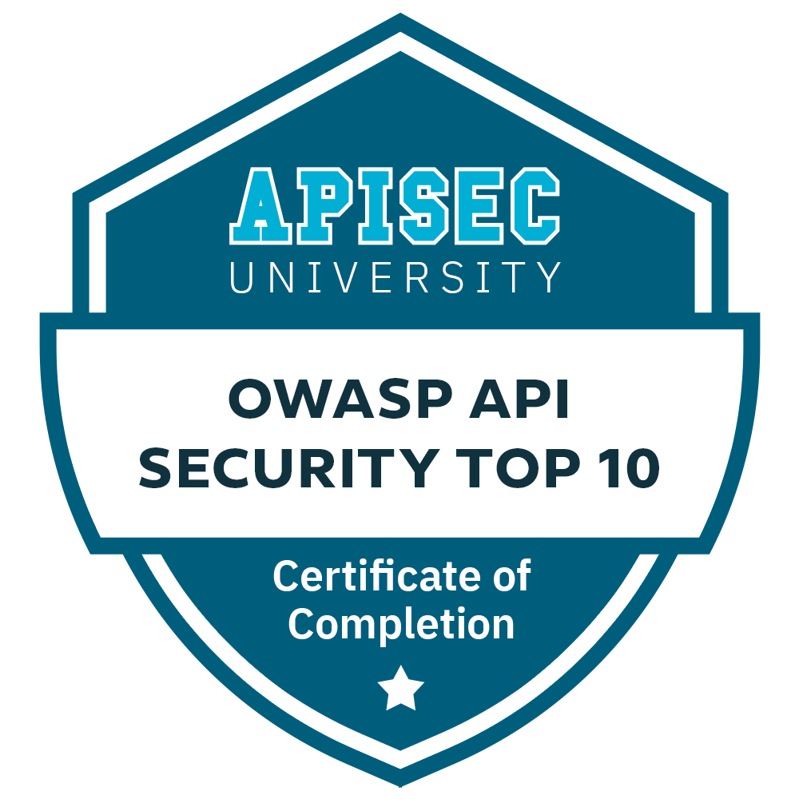
  </a>

### Cisco Networking Academy Badges

  <a href="https://www.credly.com/badges/d3c1b48d-5505-4957-b3af-0288ec45cf0a/public_url" target="_blank">
    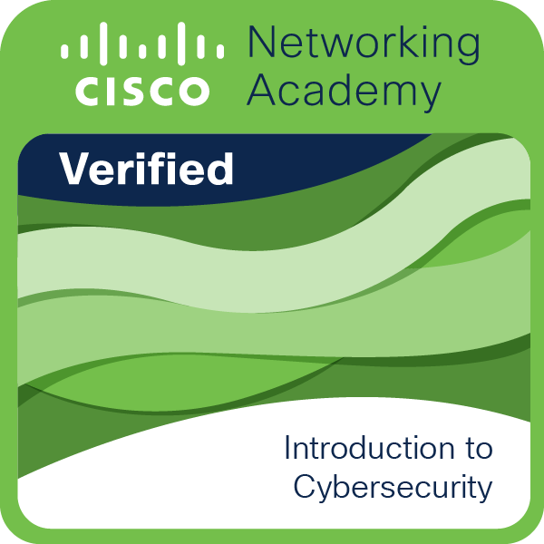
  </a>

### ISC2 Badges

  <a href="https://www.credly.com/badges/04d587cb-38a8-4a26-85c8-75a0776bde19/public_url" target="_blank">
    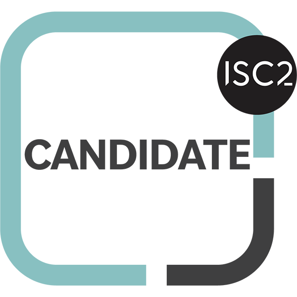
  </a>

### Cybersecurity Certifications

  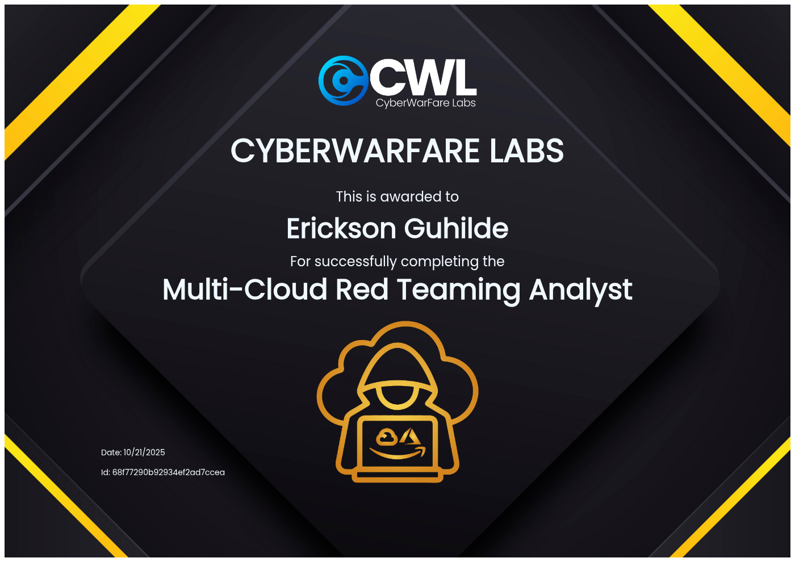
  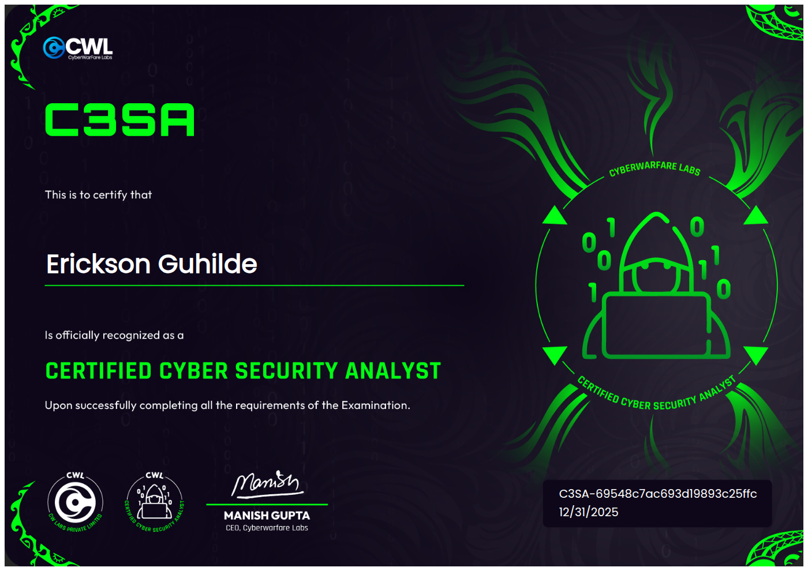
  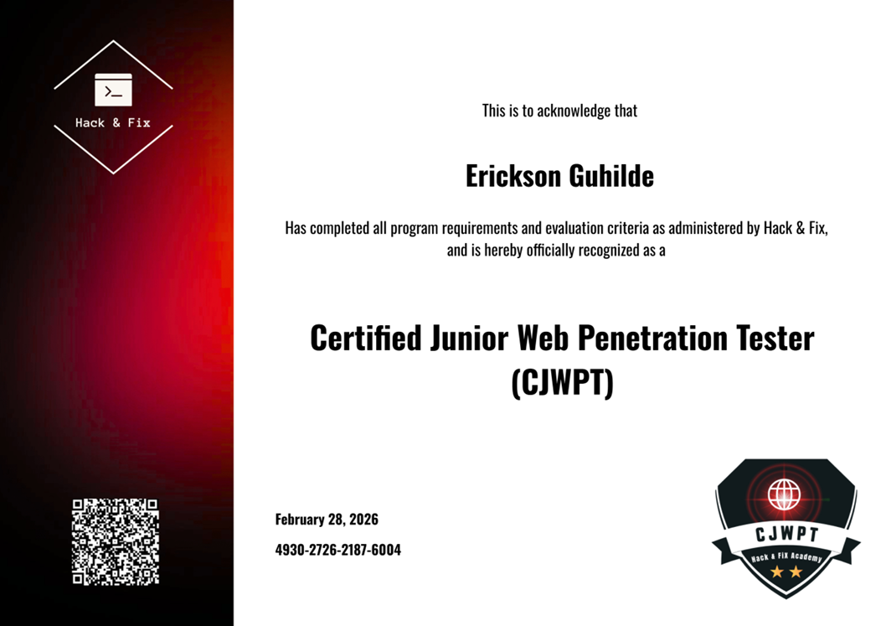
  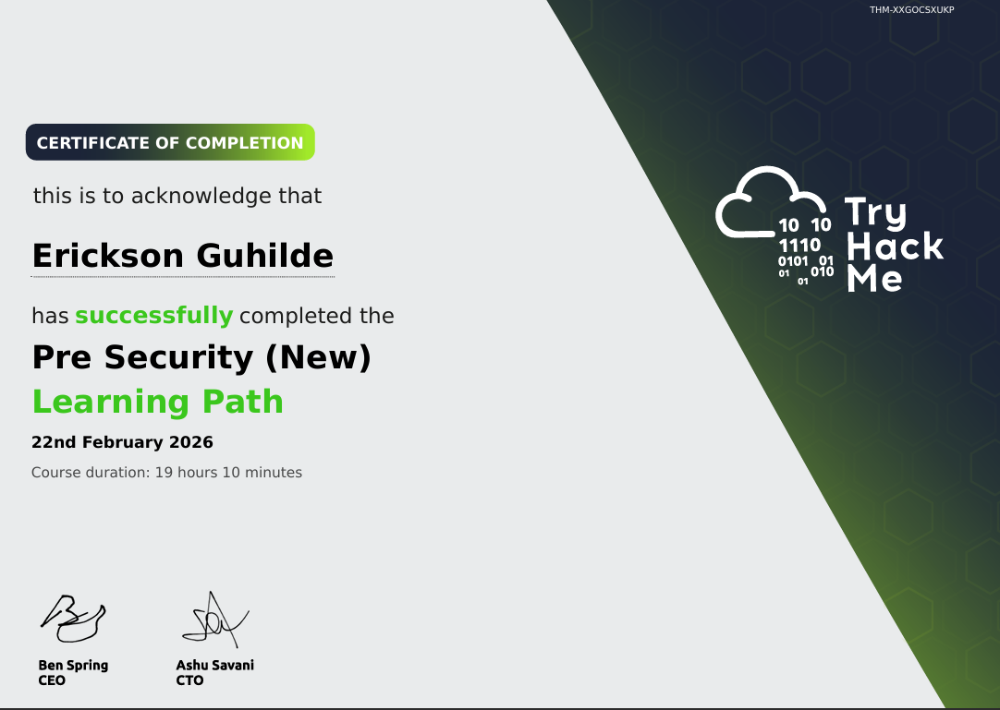

### Capture The Flag Certifications

  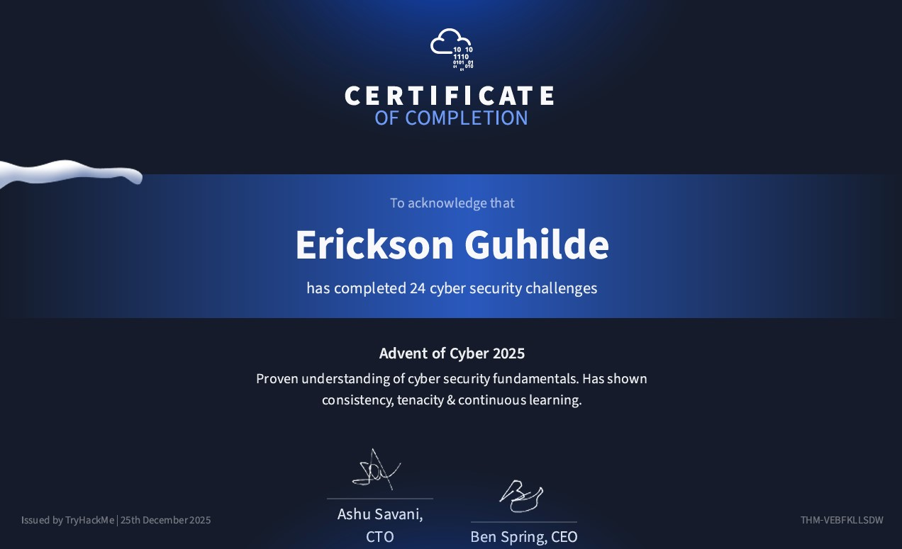
  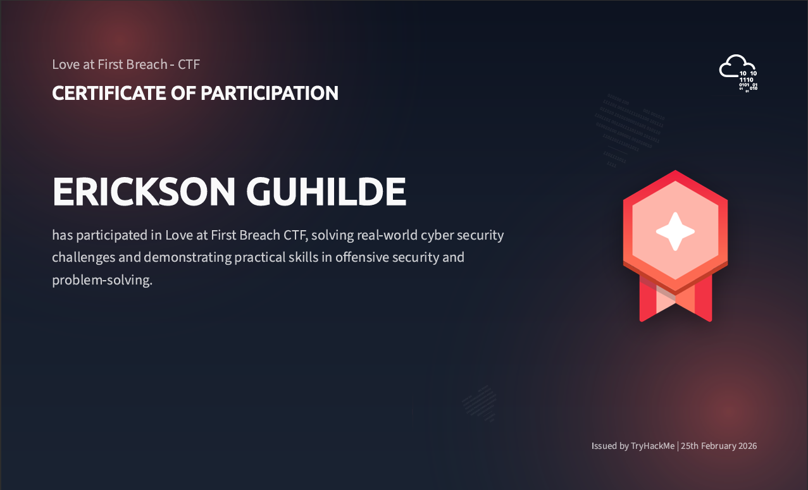
  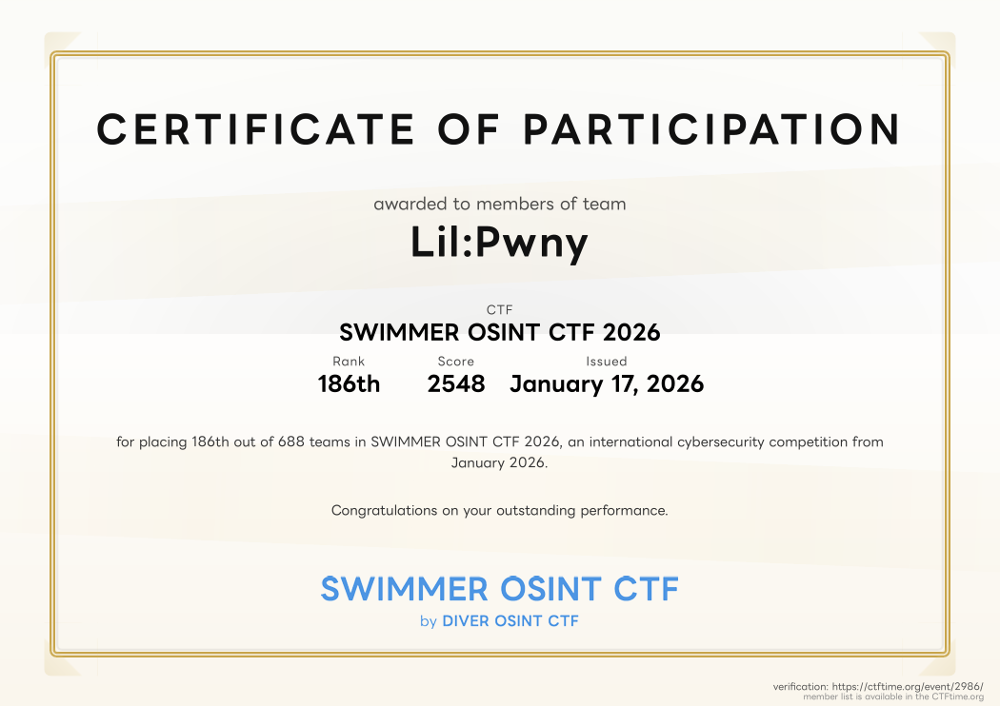

---

### GitHub Analytics

  
  
  

 

  

---

### Connect With Me

  
  

  

  

